  <picture>
    <source media="(prefers-color-scheme: dark)" srcset="dark_mode.svg" />
    <source media="(prefers-color-scheme: light)" srcset="light_mode.svg" />
    
  </picture>

  <a href="https://toqitahamid.com">Website</a> &middot;
  <a href="https://scholar.google.com/citations?user=i1SmuwYAAAAJ&hl=en">Scholar</a> &middot;
  <a href="https://linkedin.com/in/toqitahamid">LinkedIn</a>

